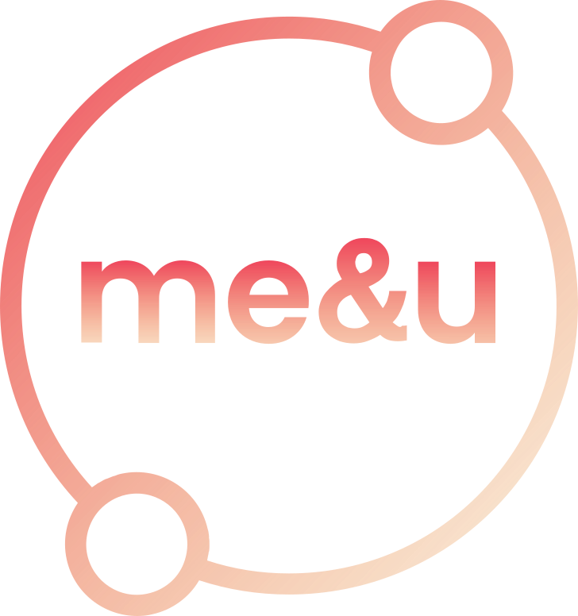

<!--
*** Thanks for checking out the Best-README-Template. If you have a suggestion
*** that would make this better, please fork the repo and create a pull request
*** or simply open an issue with the tag "enhancement".
*** Don't forget to give the project a star!
*** Thanks again! Now go create something AMAZING! :D
-->

<!-- PROJECT SHIELDS -->
<!--
*** I'm using markdown "reference style" links for readability.
*** Reference links are enclosed in brackets [ ] instead of parentheses ( ).
*** See the bottom of this document for the declaration of the reference variables
*** for contributors-url, forks-url, etc. This is an optional, concise syntax you may use.
*** https://www.markdownguide.org/basic-syntax/#reference-style-links
-->

<!-- PROJECT LOGO -->
 

  

<h3 align="center">Me&UofC</h3>

  

    Bringing students togeher
     
    Link: <a href="https://meanduofc.netlify.app/">Link to the website</a>
     
    CPSC 471 | Group : #19
  

<!-- TABLE OF CONTENTS -->

  
Table of Contents

  <ol>
    <li>
      <a href="#about-the-project">About The Project</a>
      <ul>
        <li><a href="#built-with">Built With</a></li>
      </ul>
    </li>
    <li>
      <a href="#about-the-project">Contributors</a>
    </li>
  </ol>

<!-- ABOUT THE PROJECT -->

## About The Project

Me&UofC serves as a full stack web applciation to serve the needs of students attending the University of Calgary. Due to a perceived lack of social interaction between students over the course of the pandamenic, it was evident that students needed a channel to interact with their peers for their classes. This is the purpose for Me&UofC.

This appplicaiton is a reddit like community forum by which users are able to make posts. Users are also able to interact with other users posts and send direct messages to other users in the system. Admins manage each community. 

### Built With

- [React.js](https://reactjs.org/)
- [Flutter](https://vuejs.org/)
- [Node](https://nodejs.org/)
- [Express](https://expressjs.com/)
- [MySQL](https://www.mysql.com/)

(<a href="#top">back to top</a>)

## Contrbutors

- Tyler Tran
- Dat Lam
- Tommy Tran
- Amanda Nguyen

(<a href="#top">back to top</a>)

## Run Locally

In the scenario in which you want to access the UI locally (such as in the case where the website deployment has ceases) do the following...

<ol>
  <li> Open terminal on the root directory</li>
  <li> Navigate to `./client` </li>
  <li> Open terminal on the root directory</li>
  </ol>
